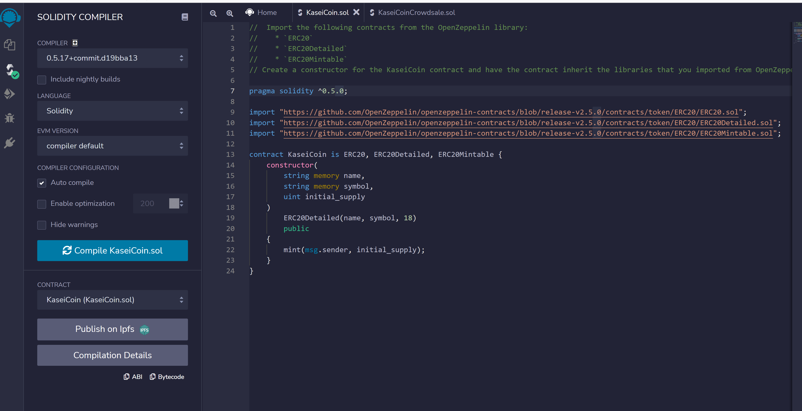
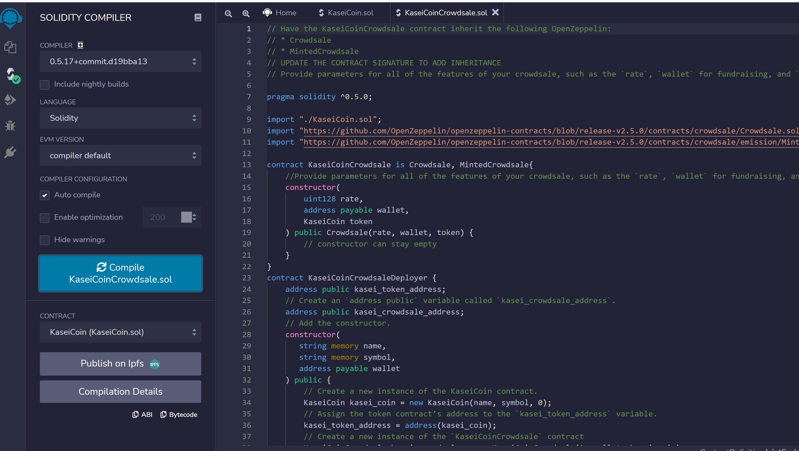

<div id="top"></div>
<br />

<h3 align="center">Tokenomics - Kaseicoin</h3>

  <p align="center">
  Kaseicoin is a new ERC20 (fungible) token that was developed for a hypothetical colony on Mars. 
    <a href="https://github.com/jtengsico/21-Tokenomics.git">
  </p>
</div>

<!-- TABLE OF CONTENTS -->
<details>
  <summary>Table of Contents</summary>
  <ol>
    <li><a href="#built-with">Built With</a></li>
    <li><a href="#installation">Installation</a></li>
    <li><a href="#results">Results</a></li>
    <li><a href="#license">License</a></li>
    <li><a href="#acknowledgments">Acknowledgments</a></li>
  </ol>
</details>

<p align="right">(<a href="#top">back to top</a>)</p>

<!-- Built With -->
### Built With
* Solidity 
* Remix
* Metamask
* Ganache

<p align="right">(<a href="#top">back to top</a>)</p>

<!-- Installation -->
### Installation 

To setup this program on your desktop, please clone the repo.
 ```sh
   git clone https://github.com/jtengsico/21-Tokenomics.git
   ```
You can run all of the .sol files in Remix. 
For Metamask and Ganache, you will need to set up an account in order to use them. 
Note: Did not do optional section but will do so in the future

<p align="right">(<a href="#top">back to top</a>)</p>

<!-- Results -->
### Results
1. KaseiCoin Compiled


2. KaseiCoinCrowdsale Compiled 
  

<p align="right">(<a href="#top">back to top</a>)</p>

<!-- LICENSE -->
### License

Distributed under the MIT License.
See [license txt](https://github.com/git/git-scm.com/blob/main/MIT-LICENSE.txt)

<p align="right">(<a href="#top">back to top</a>)</p>

<!-- ACKNOWLEDGMENTS -->
## Acknowledgments
Credit to creator of readme template. The repo also has useful resources. 
* [README Template](https://github.com/othneildrew/Best-README-Template.git)

<p align="right">(<a href="#top">back to top</a>)</p>
